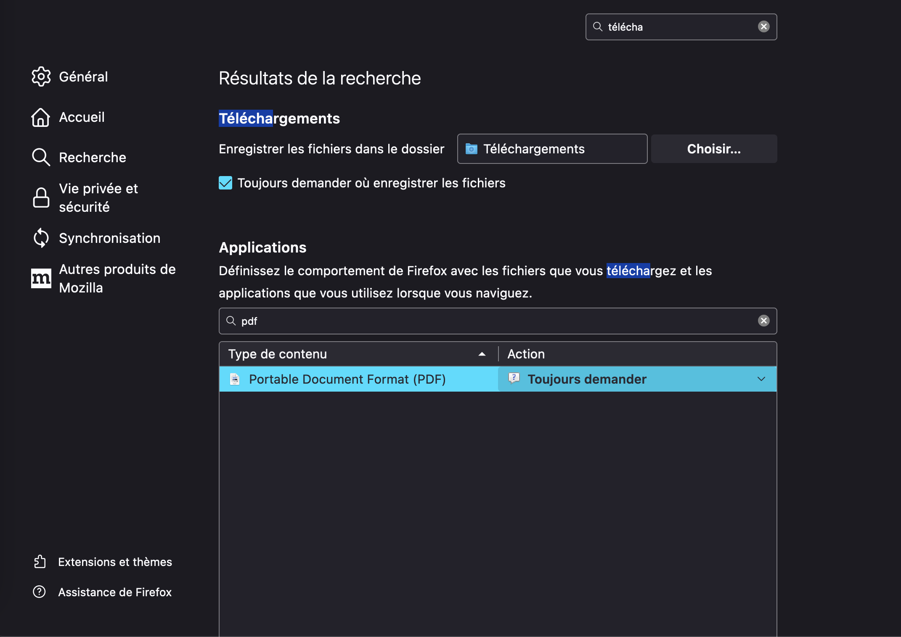
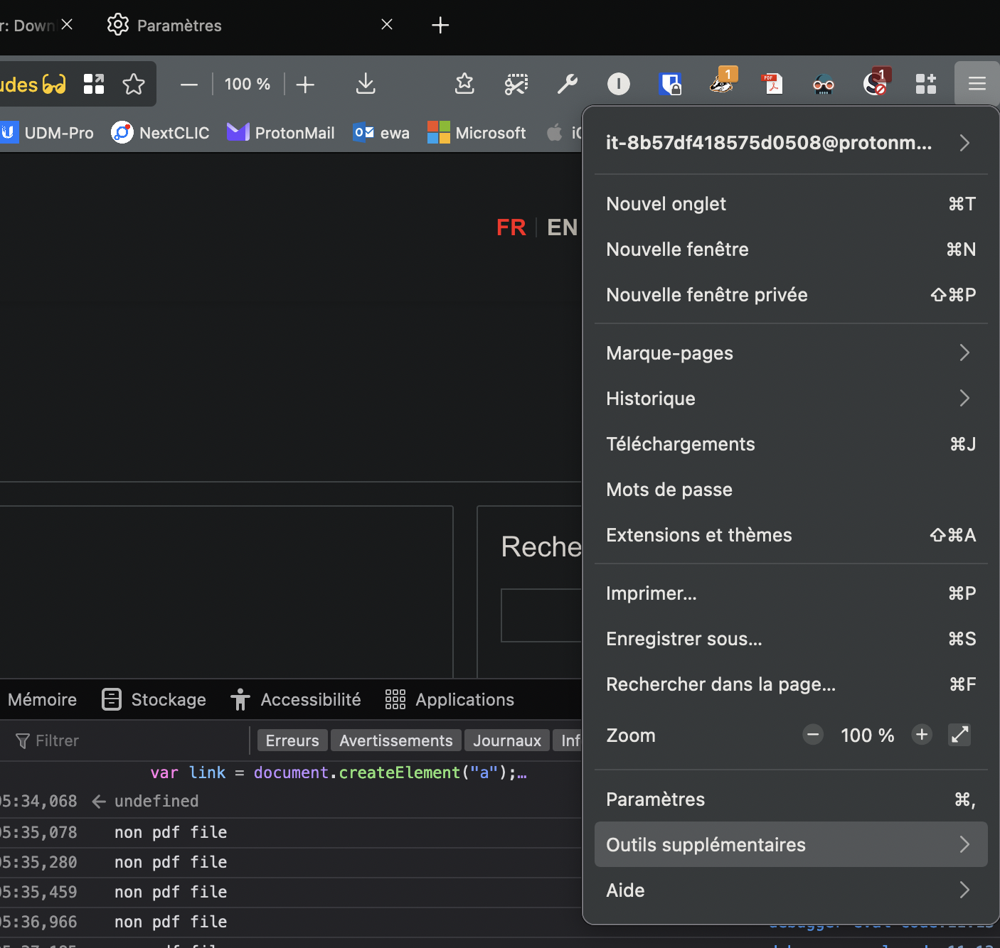
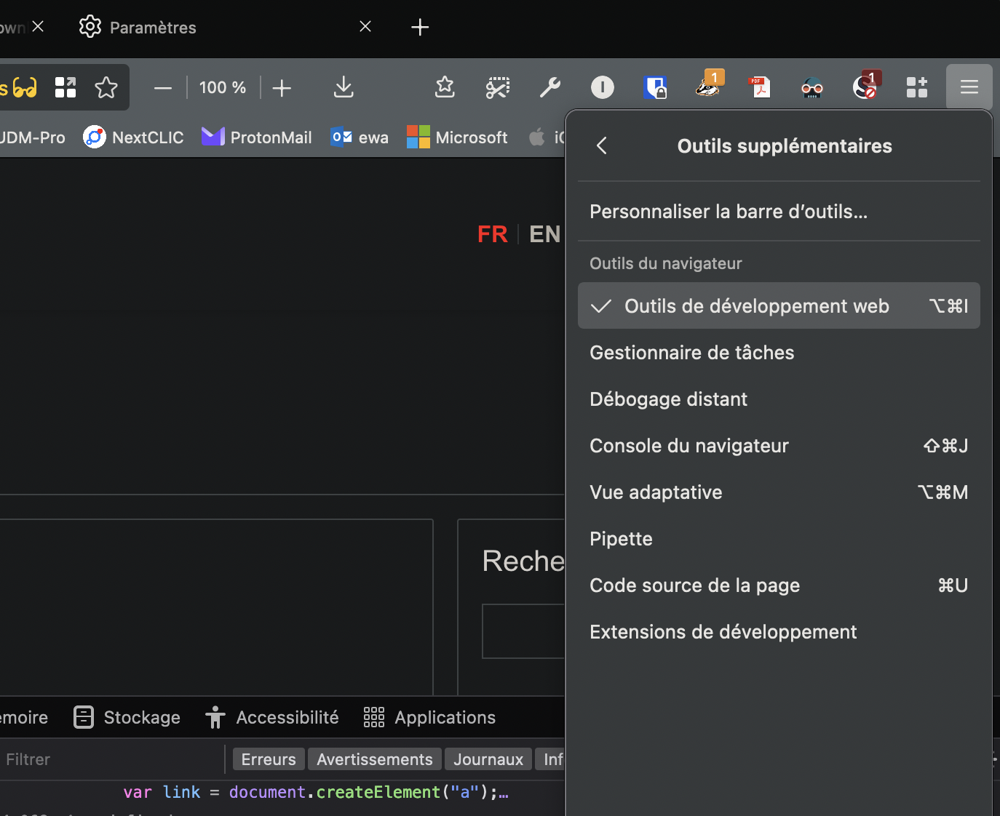

# moodle-scrapper

Downloading all the content from Moodle course page is tremendously long and boring. This script aims to automate the download of a Moodle page's available material.

## History

In order to archive material and be able to efficiently work for exams, it's useful to get all documents. Moodle has "protections" to prevent batch downloads. This scripts aims to be a workaround the workaround :)

## Usage

### Avoid opening all in tabs

First, make sure that you do not have automatic opening of PDF files (this will avoid having 35+ open tabs by the script). For example in Firefox: 

### Where this script can be used

You can use the script once in a course's page. For example, you can go to the AICC-II course page via [https://moodle.epfl.ch/course/view.php?id=15838](https://moodle.epfl.ch/course/view.php?id=15838)

### Where to put the script

The script uses JavaScript and should be run in the interactive console of your web browser. The choice for this is that using directly you browser remove the need for dealing with Tequila: you are already using the environment you are logged in. For example to open the console in Firefox, you can do:

### How to run the script

In the open console, you can paste the script and click on "execute". You will be prompted for the download of each files (**you can select "apply same rule to all" and download everything at once**) 🥳. See the video tutorial.

### Troubleshooting

If the script does not launch after a dozen of seconds, try to reload the page and restart it!

### What this script does

This script goes through all resources present on the main page and download these, bypassing the Moodle protection. This could be done by hand and is not forbidden, it's just faster. However be aware that batch sharing the material on public platforms follows other laws, make sure not to break these ;)

This script only downloads PDF files (slides and lecture notes in general). For convenience, we did not include other types of media as these could be large (mp4 video) or redundant (pptx of the PDF).

### What this script does not

This script does not download files of type other than PDF nor does it download file present in "folder" or forums.
